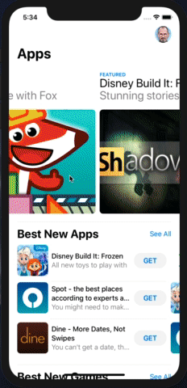

# AppStore
⚠️ Experimental Stuff ⚠️ 

App Store using SwiftUI + Combinational layouts + Combine + more iOS 13 Goodies

This is an experimental project to see how some of the newly announced iOS 13 features works. A big part of the project is made up of[ UICollectionView Compositional Layout](https://developer.apple.com/documentation/uikit/views_and_controls/collection_views/using_collection_view_compositional_layouts_and_diffable_data_sources) and SwiftUI elements. There is also a dash of Combine framework. I decided to mix and match UIKit & SwiftUI components to see how apps could integrate.

## What I've done
Used UICollectionViewCompositionalLayout to create 3 layouts without nesting UICollectionViews and all working on the same data type, it truly is amazing.

I created three different UICollectionViews, which are SwiftUI components hosted onto UIKit elements using UIHostingController, which basically takes a SwiftUI View and produces a UIViewController. I've used autolayout as the glue, and used Combine framework to pass data between these two worlds.

Each of the horizontal rows are unique layouts. The views are composed of SwiftUI elements.

## What's left to be done

Nothing! This was a weekend experiment to see what the new iOS13 APIs had to offer.

## Resources

- Paul Hudson's [SwiftUI By Example](https://www.hackingwithswift.com/quick-start/swiftui) 
- WWDC [215: Advances in Collection View Layout] (https://developer.apple.com/videos/play/wwdc19/215/) & [220: Advances in UI Data Sources](https://developer.apple.com/videos/play/wwdc19/220/)
- Inspired by [Brian Voong's course] (https://www.letsbuildthatapp.com/course/AppStore-JSON-APIs) where he built the app store using the old APIs and got me thinking.
